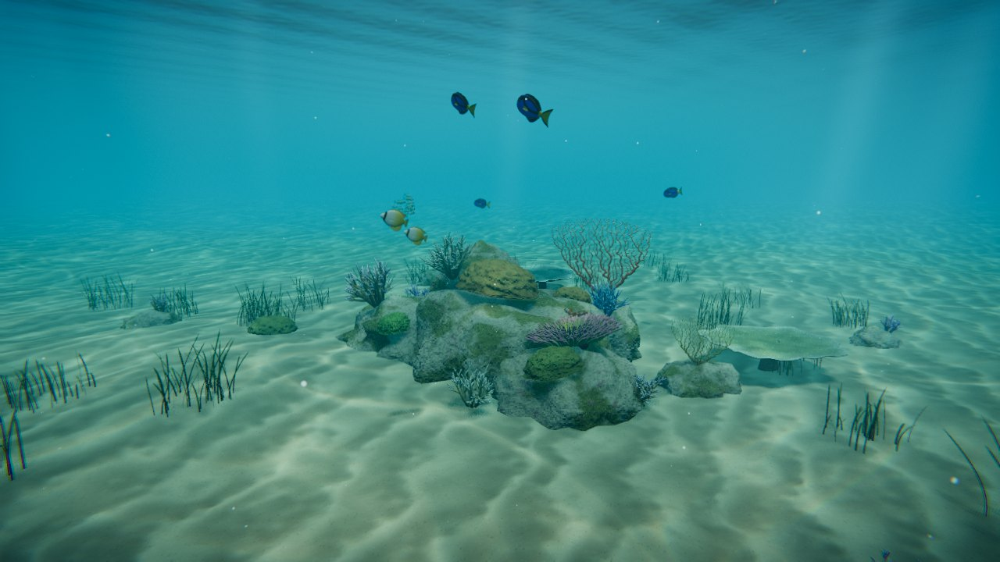

# Reef Aquarium: a Great Barrier Reef diving sim proof of concept

A small WebGL (three.js) reef "aquarium": one coral bommie on a sand flat, with a
few resident fish. The goal is to settle the look, the water model and the
asset pipeline before building the full dive simulator.



## Running

```bash
npm install
npm run dev        # http://localhost:5173
npm run build      # static bundle in dist/ (~170 kB gzipped, no binary assets)
npm run build:single  # also writes dist/reef-aquarium.html, one self-contained file
```

Open the app through a server (`npm run dev` or a deployed build), not by
opening the repository's `index.html` directly. That file is the Vite source
entry and only works once it has been built.

### Deploying

- **GitHub Pages:** `.github/workflows/pages.yml` builds on every push and
  publishes `dist/`. One-time setup: go to **Settings → Pages → Build and
  deployment → Source** and choose **GitHub Actions**.
- **Single file:** `dist/reef-aquarium.html` has the app script inlined. Use
  it for hosts that block separate script files, such as Claude artifacts, or
  to share the aquarium as one file.
- Add `?quality=low` or `?quality=high` to override the automatic choice.
  Phones get the low tier by default, which lowers the resolution, turns off
  MSAA and uses smaller shadows.
- If something fails, the reason appears on screen: no WebGL 2, a shader that
  won't compile on that GPU, the GPU resetting, or a script error. Include
  that text when reporting a problem.

- `?asset=<name>` or `#<name>` opens a single asset on the sand for look-dev, e.g.
  `?asset=clownfish`, `?asset=brainCoral`. The on-screen picker does the same.
- Controls: drag to orbit, scroll/pinch to zoom, right-drag to pan. The camera
  auto-orbits when idle.

## What's in it

**Fish.** Each fish is built from a side-view profile plus a painted side-view
pattern, and swims on the GPU with a travelling body wave and rowing pectoral fins
(`src/assets/fish/`). Movement comes from boids steering.

| Species | Notes |
| --- | --- |
| Clown anemonefish (*Amphiprion percula*) | Stays close to its anemone |
| Blue tang (*Paracanthurus hepatus*) | Swims loose laps around the bommie |
| Blue-green chromis (*Chromis viridis*) | Tight school above the staghorn |
| Threadfin butterflyfish (*Chaetodon auriga*) | Swims as a pair; false eyespot on the dorsal fin |

**Coral and plants.** All procedural, with per-pixel surface detail
(`src/assets/coral/`, `plants/`, `terrain/`):

- Brain coral. The labyrinth comes from a Gray-Scott reaction-diffusion
  simulation that is baked once and mapped triplanar.
- Staghorn *Acropora*. Branches split recursively and have pale growing tips
  and cellular corallites.
- Table coral. A plate on a stalk, with a branchlet texture.
- Magnificent sea anemone. About 700 phyllotaxis-placed tentacles that sway in
  the current.
- Gorgonian sea fan. A net where twigs knit together and thicken toward the
  holdfast. It sways as one sheet.
- Seagrass tufts, reef rock (limestone with coralline algae and turf), and a
  rippled coral-sand seabed.

**Water.** The water is clear but not invisible (`src/water/`):

- Every material gets the same underwater shader patch
  (`src/water/underwater.js`). Light fades per wavelength with distance, so
  reds go first. Deeper light is bluer. Distant objects dissolve into a water
  colour that depends on view direction and matches the background.
- Animated, slightly chromatic caustics modulate the sunlight and respect
  shadows.
- From below, the surface shows Snell's window with total internal reflection
  outside it.
- God-ray shafts flicker with the swell. Marine snow drifts past.
- A lens post-process adds bloom, a refraction wobble, light chromatic
  fringing, a blue-green vignette and grain.

All of the water's tunables sit in one `water` uniforms object. That makes it
easy to re-grade the whole scene, for example per dive site.

## Layout

```
src/
  core/        app (renderer, lights, loop), post-processing
  water/       underwater shader layer, surface/dome/god rays/marine snow
  assets/      catalog.js (registry), fish/, coral/, plants/, terrain/, materials.js
  scenes/      reef.js (the aquarium), showcase.js (single-asset viewer)
  util/        noise, curves, tube builder, GLSL snippets, reaction-diffusion
tools/
  screenshot.mjs   headless renders for visual iteration
  sheet.py         contact sheets of renders
```

`src/assets/catalog.js` is the single entry point for reusing assets in the
full build. Every asset is a pure factory with options for size, seed and
palette.

## Visual iteration

```bash
node tools/screenshot.mjs shots reef="" clown="asset=clownfish" \
  close="cam=2.6,1.5,2.8&target=0.4,0.8,0.2"
```

This renders in headless Chromium (SwiftShader) with a deterministic warm-up
(`t=` seconds of simulation).
