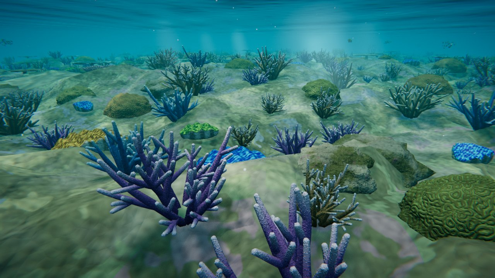
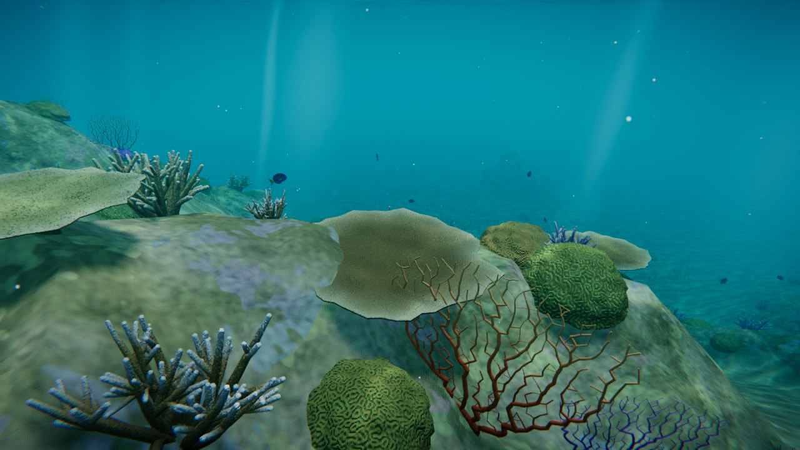
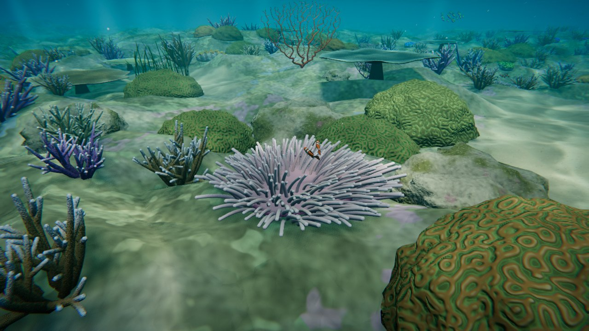
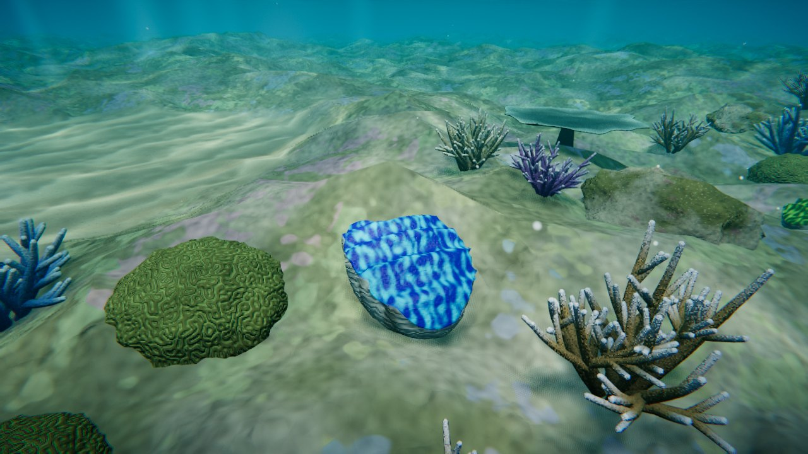
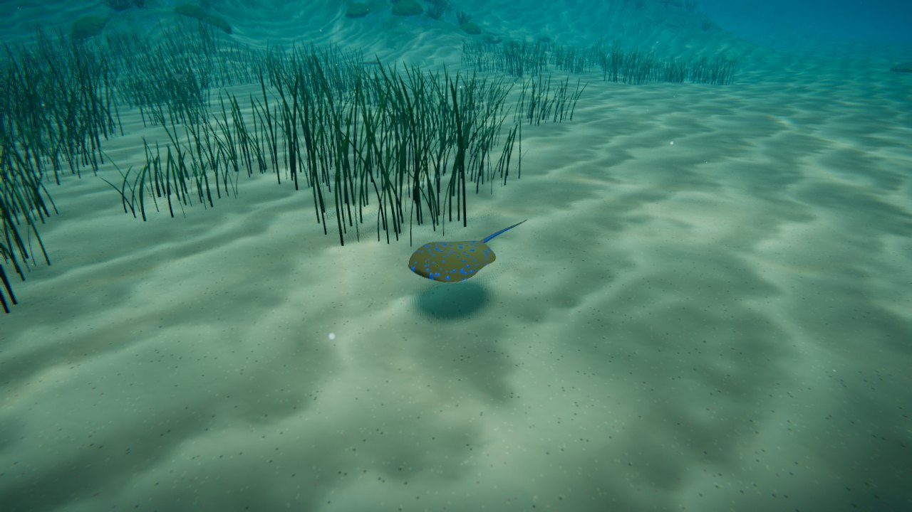

# Reef Aquarium: a Great Barrier Reef diving sim

A WebGL (three.js) dive simulator. It opens on a procedural Great Barrier
Reef dive site. The original proof-of-concept aquarium, a single bommie with
a few fish, is still available from the picker.



| | |
| --- | --- |
|  |  |
|  |  |

## Running

```bash
npm install
npm run dev        # http://localhost:5173
npm run build      # static bundle in dist/ (~170 kB gzipped, no binary assets)
npm run build:single  # also writes dist/reef-aquarium.html, one self-contained file
```

Open the app through a server (`npm run dev` or a deployed build), not by
opening the repository's `index.html` directly. That file is the Vite source
entry and only works once it has been built.

### Deploying

- **GitHub Pages:** `.github/workflows/pages.yml` builds on every push and
  publishes `dist/`. One-time setup: go to **Settings → Pages → Build and
  deployment → Source** and choose **GitHub Actions**.
- **Single file:** `dist/reef-aquarium.html` has the app script inlined. Use
  it for hosts that block separate script files, such as Claude artifacts, or
  to share the aquarium as one file.
- Add `?quality=low` for devices that struggle. It lowers the resolution,
  turns off MSAA and uses smaller shadows. The full look is the default
  everywhere.
- If something fails, the reason appears on screen: no WebGL 2, a shader that
  won't compile on that GPU, the GPU resetting, or a script error. Include
  that text when reporting a problem.

- The **View** picker switches between the reef, the aquarium and single
  assets. Deep links use `#aquarium` or `#<asset>`, for example `#giantClam`
  or `#eagleRay`. `?asset=<name>` also works.
- **Reef controls:** drag to look, WASD or the arrow keys to swim, Space/E to
  rise, Q/C to sink, Shift to kick harder. On touch screens, use the left
  stick and the ▲ ▼ buttons. When idle, the diver drifts on an auto-tour;
  any input takes over.
- **Aquarium and asset controls:** drag to orbit, scroll or pinch to zoom,
  right-drag to pan.

## The reef

`src/scenes/gbr.js` builds the dive site from `src/assets/terrain/reefTerrain.js`.

- **Terrain:** a fringing-reef profile. A shallow reef flat about 2.5 m deep
  (hard pavement with sand pools) drops over the crest to a spur-and-groove
  slope: coral ridges running down-slope, with sand channels between them.
  The slope ends in a sand plain about 13 m deep with scattered bommies. Height
  and a sand-to-reef substrate value are baked into grids. Placement, fish
  steering and camera collision all read from them.
- **Placement:** candidates on a jittered 0.7 m grid are kept by substrate and
  a patchiness field. Each zone (flat, slope, bommie) has its own mix of
  coral types. A spacing check stops colonies from overlapping. Seagrass
  meadows, rocks and the odd clam go on the sand.
- **Instancing and level of detail:** each type has several variants. They
  are instanced in 12 m chunks, with a detailed version near the diver, a
  light version further out, and nothing past the haze. Only nearby coral
  casts shadows. That puts about 1,100 staghorns, 500 brain corals, 300 table
  corals, 140 sea fans, 150 giant clams and 850 seagrass tufts on the reef.
  Busy views draw about 7–10M triangles in 300–600 draw calls.
- **Life:**
  - clownfish families in the anemones;
  - chromis clouds over staghorn;
  - blue tang groups and butterflyfish pairs;
  - blue-spotted ribbontail rays that cruise the sand and settle to rest;
  - a trio of spotted eagle rays flying in formation over the slope.
  Schools out of view keep simulating but aren't drawn.

New assets in this build:

- **Giant clam (Tridacna):** a fluted shell whose folds give the gape its
  zigzag. The mantle is patterned, breathes slowly and glows slightly. It
  comes in four colourways.
- **Rays (`src/assets/rays/rays.js`):** one parametric disc-and-tail builder
  with a GPU fin wave, used for two species:
  - the blue-spotted ribbontail, which ripples its fin edges;
  - the spotted eagle ray, which flaps its wings.

## What's in it

**Fish (aquarium and reef).** Each fish is built from a side-view profile plus a painted side-view
pattern, and swims on the GPU with a travelling body wave and rowing pectoral fins
(`src/assets/fish/`). Movement comes from boids steering.

| Species | Notes |
| --- | --- |
| Clown anemonefish (*Amphiprion percula*) | Stays close to its anemone |
| Blue tang (*Paracanthurus hepatus*) | Swims loose laps around the bommie |
| Blue-green chromis (*Chromis viridis*) | Tight school above the staghorn |
| Threadfin butterflyfish (*Chaetodon auriga*) | Swims as a pair; false eyespot on the dorsal fin |

**Coral and plants.** All procedural, with per-pixel surface detail
(`src/assets/coral/`, `plants/`, `terrain/`):

- Brain coral. The labyrinth comes from a Gray-Scott reaction-diffusion
  simulation that is baked once and mapped triplanar.
- Staghorn *Acropora*. Branches split recursively and have pale growing tips
  and cellular corallites.
- Table coral. A plate on a stalk, with a branchlet texture.
- Magnificent sea anemone. About 700 phyllotaxis-placed tentacles that sway in
  the current.
- Gorgonian sea fan. A net where twigs knit together and thicken toward the
  holdfast. It sways as one sheet.
- Seagrass tufts, reef rock (limestone with coralline algae and turf), and a
  rippled coral-sand seabed.

**Water.** The water is clear but not invisible (`src/water/`):

- Every material gets the same underwater shader patch
  (`src/water/underwater.js`). Light fades per wavelength with distance, so
  reds go first. Deeper light is bluer. Distant objects dissolve into a water
  colour that depends on view direction and matches the background.
- Animated, slightly chromatic caustics modulate the sunlight and respect
  shadows.
- From below, the surface shows Snell's window with total internal reflection
  outside it.
- God-ray shafts flicker with the swell. Marine snow drifts past.
- A lens post-process adds bloom, a refraction wobble, light chromatic
  fringing, a blue-green vignette and grain.

All of the water's tunables sit in one `water` uniforms object. That makes it
easy to re-grade the whole scene, for example per dive site.

## Layout

```
src/
  core/        app (renderer, lights, loop), post-processing
  water/       underwater shader layer, surface/dome/god rays/marine snow
  assets/      catalog.js (registry), fish/, coral/, plants/, terrain/, materials.js
  scenes/      reef.js (the aquarium), showcase.js (single-asset viewer)
  util/        noise, curves, tube builder, GLSL snippets, reaction-diffusion
tools/
  screenshot.mjs   headless renders for visual iteration (reef: tour=0..1, near=clam|anemone|ribbontail|eagleRay|chromis)
  probe.mjs        triangle budget per asset group, boot time
  inline-build.mjs single-file build (npm run build:single)
  sheet.py         contact sheets of renders
```

`src/assets/catalog.js` is the single entry point for reusing assets in the
full build. Every asset is a pure factory with options for size, seed and
palette.

## Visual iteration

```bash
node tools/screenshot.mjs shots reef="" clown="asset=clownfish" \
  close="cam=2.6,1.5,2.8&target=0.4,0.8,0.2"
```

This renders in headless Chromium (SwiftShader) with a deterministic warm-up
(`t=` seconds of simulation).
